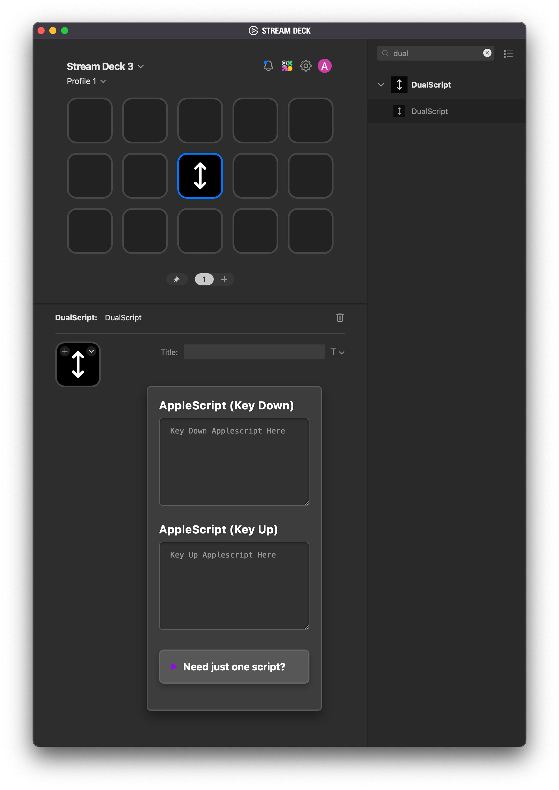

# DualScript

## Description

**DualScript** is a macOS-only Stream Deck plugin that lets you run separate AppleScript snippets on key-press (Key Down) and key-release (Key Up). It builds on the original `streamdeck-osascript` plugin, updated to SDK v2, and adds:

- Two distinct AppleScript text areas—one for Key Down and one for Key Up  
- If you leave one field empty, DualScript will only run the other script on its event

Use DualScript to trigger notifications, open applications, or perform any macOS automation directly from your Stream Deck key.

---

## Installation

1. **Download** the latest `com.apresley.dualscript.streamDeckPlugin` from the [Releases](https://github.com/austinpresley/DualScript/releases) page.  
2. **Double-click** `com.apresley.dualscript.streamDeckPlugin`. Stream Deck will install DualScript and reload.  
3. In the Stream Deck app’s sidebar under **Installed Plugins**, you’ll see **DualScript**. Drag it onto any key to assign.

---

## Configuration (Property Inspector)

With DualScript assigned to a key, click that key to open its Property Inspector. You’ll see two AppleScript fields:

1. **AppleScript (Key Down)**  
   Enter any valid AppleScript here to run when you press the key.

2. **AppleScript (Key Up)**  
   Enter any valid AppleScript here to run when you release the key.

- If one field is left blank, DualScript will only run the other script on its event.  
- Scripts execute immediately when the event happens—no additional setup required.

